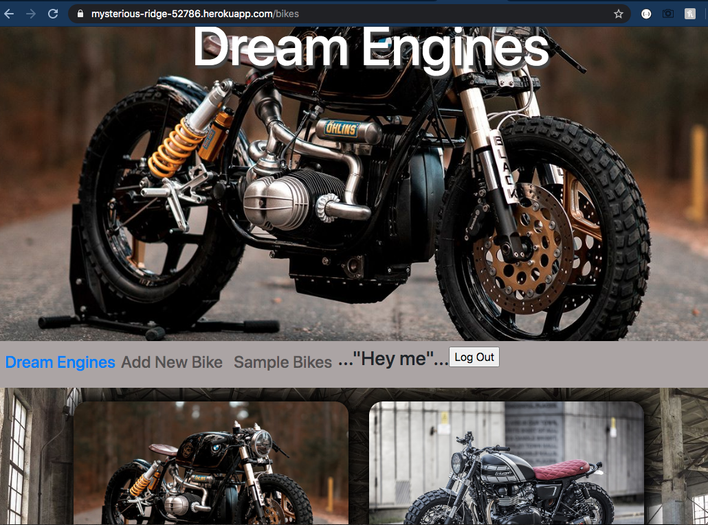

# Dream Engines

- This is a responsive site that utilizes both front end and back end web development.

- Using Html, Css, Bootstrap, Ejs and Javascript for front end.

- Using Node.js, Server.js, Node Packages, Json, Mongodb Atlas, and Heroku for the back end.

- Also the model in this site puts to use the 7 RESTful routes, full CRUD, and employs the MVC file structure.

- As part of this site Ejs partials were taken advantage of to help limit repetition.

- This site has also incorporated sign up and log in functionality, including encrypted passwords and an authorization flow.

- To be advantageous I have also inserted an opening/about me/how to use page.

- For updates of this project I would like to include additional relationships for models.

- https://mysterious-ridge-52786.herokuapp.com/
